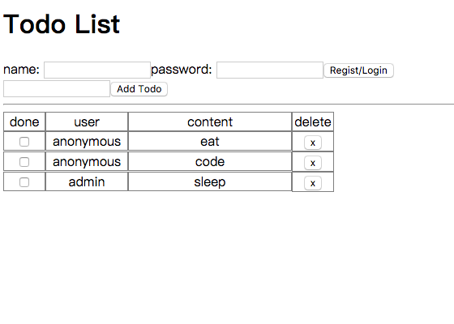

# Todo List v2.0

我们在上一章已经配置好了一个比较完整的开发环境了，后面的开发我们都可以直接使用上一章的示例中的 .babelrc 
.eslintrc package.json webpack.config.js 等文件中的相关配置，根据需要添加或修改即可 (说白了，把这些文
件拿过来，`npm install` 一下环境就搭好了) 。当然，网上也有很多类似的脚手架工具，其中开发 React 最方便的脚
手架莫过于官方的 [create-react-app](https://github.com/facebookincubator/create-react-app) 工具
了，基本上可以一键搭建好一个现成的 React 开发环境。其配置的内容和方便程度也是远胜与之前章节提到的 (其实前面
章节都是在熟悉和使用脚手架里面用到的一些工具) 。

在引言里我们提到要实现一个多人共享的开发的 Todo List 应用，现在就让我们开始完善我们的代码。在这一章里我们还是
使用原生的两个库，然后尝试按官方文档里 `thinking-in-react` 的思路来设计我们的应用。

## thinking-in-react

1. 画模型图

~~作为一个程序猿直男，你让我画模型图？算了吧，放弃这一步，等以后找个美工女盆友再说吧 (***伪命题***) 。~~

既然不画模型图，这里就头脑风暴一下我们的数据结构怎么设计吧，其实这也可以是一个设计的入口。我们要做一个多人共享的 
Todo List 应用，所以至少我们应该有两部分数据: 1)用户，姑且叫做 `doer` 吧 (个人不喜欢用 `user` 容易和数据库
的关键字冲突)； 2)待办，姑且叫做 `todo` 吧。两个的关联关系应该是 `doer` 1 - N `todo` ，当然如果以后要做多人
协作的 Todo 可能还需是要改成 M - N 的关系，到时候加个中间表吧，这里先不考虑。 `doer` 和 `todo` 在数据库通过
外键关联，在前台我们可以直接将 `doer` 对象赋值在 `todo` 内部，不过为了减少冗余数据，我们暂时将两组数据分开。
这样我们暂定的数据结构如下，接着就可以根据这个结构去 Mock 数据了。

```javascript
// ./src/api/data.js
export const doers = [
  { uid: 0, name: 'anonymous', pswd: '' },
  { uid: 1, name: 'admin', pswd: 'admin' },
];

export const todos = [
  { tid: 0, uid: 0, done: false, content: 'eat' },
  { tid: 1, uid: 0, done: false, content: 'code' },
  { tid: 2, uid: 1, done: false, content: 'sleep' },
];
```

关于数据结构的问题，这里多一句。向上面的数据结构我们看到 `doer` 和 `todo` 是两个集合，这种组织方式对数据库和后端
比较友好，但是在前端使用并不是很方便。由于 `todo` 需要引用 `doer` 所以在前台更常见的 `doer` 的组织方式可能是 
`{[uid]: doer}` 的形式，当然两种结构的转换其实也很简单，这里就不展开了，我们在完善功能的时候再说。

2. 将模型图拆分成组件

由于并没有真的模型图，这一部分我们还是以整理思路为主。结合 1. 中的数据，我们很自然的会想到我们应该有一个主组件 
(TodoApp) 来组织所有的功能组件，同时需要有用户部分 (Doer) 用来处理用户身份的区分，然后是代办部分 (Todo) ，这
一部分需要处理输入，所以我们可以再区分为交互部分 (AddTodo) 和展示部分 (TodoList) ，当然考虑到展示部分后续还会增
加排序、筛选等功能，这里的 (TodoList) 最好只用来整理数据，而真正要展示数据的部分，我们再单独起个组件 (TodoView)。

3. 实现静态版本的程序和组件

经过 2. 的拆分，我们大致需要的组件已经明确，接下来我们就可以根据~~(模型图)~~我们的设想去实现静态的版本。静态版本可以
考虑直接用 `html` 写，不过当你写习惯了 React 以后，可能会觉得用 React 写更快，毕竟可以很方便的使用循环、嵌套等方法。
这里出于熟练拆分组件的角度出发，使用 SFC (Stateless Functional Component) 来创建我们的静态页面。所有的组件统一
丢在 [UIDraft](./src/draft/UIDraft.jsx) 中。

得易于 2. 中的拆分，现在我们即可以从最外层往最里层写，也可以从最里层往最外层写。这里我们就从里到外按 TodoView -- 
TodoList -- AddTodo -- Doer 的顺序依次实现各个模块。

```javascript
/**
 * 首选是 TodoView
 * 它应该从 TodoList 拿到一条完整的 todo 然后根据需要展示部分或全部内容
 * 这里因为仅用来设计静态页面，所以我们直接从属性中解构拿到 uid content 等需要展示的属性
 */
function TodoView({ uid, content }) {
  return (
    <div>
      <input type="checkbox" />
      <span>{uid}</span>
      <span>{content}</span>
      <a href="#">delete</a>
    </div>
  );
}

/**
 * 接着是 TodoList
 * 它从 TodoApp 拿到部分或完整的 todos 经过筛选或排序后交给 TodoView 用来展示
 * 我们可以看到，这里直接对 todos 即存放 todo 的集合进行了一次 map 操作
 * 将集合内所有的元素作为 TodoView 需要的属性传递给 TodoView 并返回对应的 TodoView 组件
 * 需要指出的是这里除了 {...x} 直接将 todo 的属性解构后传递给 TodoView 外
 * 我们还额外的添加了 key 属性
 * 这一步主要是为了 React 在进行 diffs 比较的时候能够更快的定位需要比对的旧元素与新元素的关系
 * 其实 React 在 render() 之后仅是生成了虚拟 DOM 这个时候会拿新的 VirtualDOM 和老的 VirtualDOM 进行比较
 * 通过制定 key 的话可以让 React 迅速定位进行比较的对象
 * 举例来讲，之前的 DOM 节点集合为 [node-01, node-02, node-03] 的 DOM
 * 我们的操作导致 node-01 被删除，其他的未改变
 * 新 render() 得到的 DOM 节点集合为 [node-12, node-13] 如果不制定 key 的话
 * React 就会拿 node-12 与 node-01 进行比较，发现不一致后，就会销毁 node-01 然后重新生成 node-12 依次类推
 * 在比较三次后认为新生成了两个节点销毁了一个节点，接着对三处真实 DOM 结构进行操作
 * 但如果指定了 key 以后，React 就会直接拿 node-12 与 node-02 进行比较，发现没有改变，便不改变 node-02 依次类推
 * 在比较三次后知道仅删除了一个节点，而另外两个节点未改变，接着就仅对一处真实 DOM 结构进行操作
 * 其实细心的朋友在前面的 demo 里面就可以看到，实际上在 console 里面 React 已经警告了我们没用为 li 标签指定 key
 */
function TodoList({ todos }) {
  if (todos.length === 0) return null;
  return (
    <div>
      {todos.map(x => <TodoView key={x.tid} {...x} />)}
    </div>
  );
}

/**
 * 接着是 AddTodo
 * 因为是静态页面，这个比较简单就一个输入框和一个按钮，这里就不多解释了
 */
function AddTodo() {
  return (
    <div>
      <input type="text" />
      <button>Add Todo</button>
    </div>
  );
}

/**
 * 最后是 Doer
 * 原则上讲 Doer 拿到一个是否登录的状态然后决定是显示欢迎语还是注册/登录信息
 * 但这里实际上并没有设计这个状态，具体的原因会在 5. 里面提到
 * 另外，我们的这个 Doer 模块设计成注册/登录一体的，如果对应 name 已注册就坚持 password 是否匹配
 * 如果未注册，就以当前 name 和 password 注册新用户
 * 预留了 errMsg 属性用来提示 name 和 password 不匹配的情况
 * 当然这个提示语也可以拆成组件，如果你觉得多个地方会用到的时候
 */
function Doer({ doer, errMsg }) {
  if (doer) {
    return (
      <div>
        <span>{`Welecome: ${doer.name}`}</span>
        <a href="#">Logout</a>
      </div>
    );
  }
  return (
    <div>
      <label>name: </label><input type="text" />
      <label>password: </label><input type="text" />
      <button>Regist/Login</button>
      <span>{errMsg}</span>
    </div>
  );
}
```

4. 组合静态版本

其实在上一步，我们已经准备好了所有要用到的静态组件，将其进行组合即可得到完整的应用。我们新建 TodoApp 用来组织
上面的组件。

```javascript
function TodoApp({ todos }) {
  return (
    <div>
      <h1>Todo List</h1>
      <Doer />
      <AddTodo />
      <hr />
      <TodoList todos={todos} />
    </div>
  );
}
```

我们将之前准备的 Mock 数据引入，然后把 TodoApp 挂载至页面，就可以看到我们的静态页面了。

```javascript
import React from 'react';
import ReactDOM from 'react-dom';
import TodoApp from './UIDraft';
import { todos } from '../../api/data';

ReactDOM.render(
  <TodoApp todos={todos} />,
  document.getElementById('root'),
);
```

运行 `npm run draft` 打包 draft 目录下的静态页面，然后在浏览器下访问 [localhost:9000](http://localhost:9000) 
就可以看到静态页面的效果了。页面太丑了，就不截图了。

5. 设计 state 的组成和实现

到这里要进入核心部分了，首选让我们回顾一下静态页面用到的或者打算用到的数据。考虑到这个应用的实际情况，主要的数据也就是一个 
`todo` 的集合和一个 `doer` 的集合了， `todo` 由于需要用来展示，不用多说肯定考虑丢到 `state` 里面，然而 `doer` 挺
尴尬的，因为还没到做后台的时候，所以 `doer` 貌似并不需要放入 `state` 只要让组件可以接触到即可。除了核心数据，我们在 
Doer 组件内需要有当前已登陆的用户的信息 (未登陆时统一为一个匿名用户) ，当然还有一个 `errMsg` 的属性用来处理错误信息。
除了 Doer 组件，我们在 AddTodo 组件内由于含有交互信息，所以我们也考虑增加一个 `content` 属性用来控制交互或者限制输入。
总结下来，我们需要的 `state` 大致有 `todos` 、 `doer` 、 `errMsg` 、 `content` ，需要用到但是不用放入 `state` 的
数据就是 `doers` 的集合了。

接下来的问题就是，这些 `state` 该如何分配，这里有几个官方的建议可以参考。首选， React 应用遵循 **`source of truth`** 
的原则，所以核心的数据应该唯一放在一个组件进行管理，因此我们将 `todos` 放在最上层的 TodoApp 中，让其统筹两部分模块 Doer 
和 Todo 的交互。接着我们看 `doer` 和 `errMsg` ，这两个 `state` 直管感受只与 Doer 组件相关，但是细想一下，在新增 
`todo` 时我们还是需要知道当前 `todo` 是归宿在那个 `doer` 下，因此，实际上 AddTodo 也是要感知 `doer` 的，在这种情况
下我们通常让这种 `state` **向上提升至共同的父组件内**，而 Doer 和 AddTodo 的共同的组件还是 TodoApp ，所以我们把 `doer` 
也放到 TodoApp 内，至于 `errMsg` 也是同理。最后我们还剩 `content` ，我们可以大胆的把其放入 AddTodo 组件内。因为，添加
的实际方法是通过 TodoApp 传递至 AddTodo 组件内部的 (否则无法操作保存在 TodoApp 的 `state` 里的 `todos`) 。最后，我们
在 3. 里面提到，我们实际上是需要一个属性来表示登陆状态的，这里为什么没有为其设置 `state` 呢？因为， `state` 的设计还有
**最小粒度原装**，任何可以通过计算得出的状态都不应该为 `state` ，秉承这个原则我们就完全可以使用 `doer` 来表示登陆状态，
当 `doer` 为 `null` 的时候即为未登陆的匿名状态，否则为已登陆的情况。经过这样分配，我们的组件结构和包含的 `state` 大概
就是如下这样的。

```bash
TodoApp
├── state: `todos` / `doer` / `errMsg`
├── Doer
├── AddTodo
│   └── state: `content`
└── TodoList
    └── TodoView
```

6. 添加交互方法

有了上面的结构，接下来就是设计交互方法了。理一下我们需要的方法，它的位置和其执行者，可以整理出下表:

|方法名|功能|归属组件|执行组件|
|:-:|:-:|:-:|:-:|
|`login()`|注册/登陆(同时处理注册和登陆)|TodoApp|Doer|
|`logout()`|登出/注销|TodoApp|Doer|
|`handleInput()`|输入框与 `stata` 的关联事件|--|Doer / AddTodo|
|`addTodo()`|添加新的 Todo|TodoApp|AddTodo|
|`markTodo()`|修改当前 Todo 的状态(是否已完成)|TodoApp|TodoView|
|`deleteTodo()`|删除当前 Todo|TodoApp|TodoView|

到此，所有的设计就基本完成了。我们要做的就是去实现各部分功能即可 (内心os: 终于可以开始写代码了！！！) 。
v2.0 主要是和大家一起按照 React 的设计思路一步步的去实现我们的应用。可以看到过程比较繁琐，功能也还比较单一。后面继续完善功能
比如筛选、排序、按日期分组、关注等功能的开发，我就不写这么繁琐了，但其实思路都是一样的无非两点设计 `state` 和其定位，设计功能
和其定位和以及考虑实际的执行/调用者。

## 代码解析

实现上面第 6 条中的方法，我们的 Todo List 2.0 就基本完成了。这时候我们运行 `npm run start` 打包编译并启动 
`webpack-dev-server` 服务器，然后在浏览器下访问 [localhost:9000](http://localhost:9000) 就可以看到实现了基本功能的 
demo 跑起来了。



下面结合代码，对组件间的联系和大体的实现思路做个简要的分析。

1. 配置文件


## 扩展阅读
